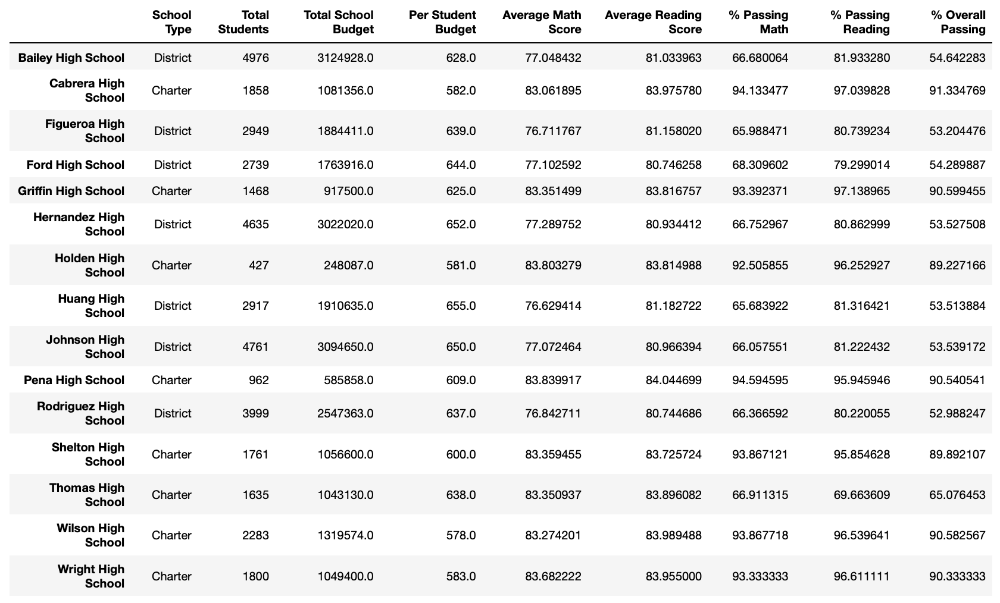
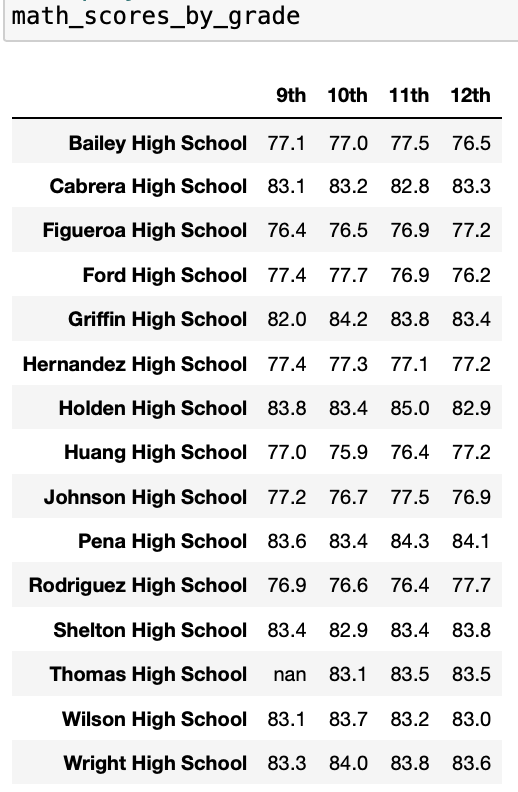

# School District Analysis - Module 4 Challenge

## Background

The School Board suspects academic dishonesty; specifically, **reading and math grades** for Thomas High School, ninth graders appear to have been altered.

The School Board does not know the full extent of this situation, but they want to investigate it, by replacing the "math and reading scores" for Thomas High School with NaNs, while keeping the rest of the data intact.

Once the math and reading scores are replaced, a comparison will be made with the initial data to see how much different categoroies are affected.

To accomplish this, Python/Jupyter Notebook will be used to:
*   capture the raw data - read.csv
*   replace the scores with NaN values - loc.
*   filter the data for each grade - loc., groupby
*   utilize indicators for analysis - count, mean, sum
*   format results - map, bins

## Deliverable 1

The "loc." method is used to select all the "reading" and "math" **scores** from the ninth grade at Thomas High School.

    1.1 A comparison operator is used to retrieve all the rows with Thomas High School in the "school_name" column of the student_data_df

    1.2 A comparison operator is used to retrieve all the rows with the ninth grade in the "grade" column of the student_data_df

    1.3 Logical and comparison operators are used to retrieve all the rows with the "reading_score" column for Thomas High School ninth graders from the student_data_df

The above three steps can be seen in the following screenshot, including the replacement of the reading scores with NaN.

    1.4 Logical and comparison operators are used to retrieve all the rows with the "math_score" column for Thomas High School ninth graders from the student_data_df

Similarly, the replacement of the Math Scores can be seen hereafter.

    1.5 The reading and math scores for the ninth graders in Thomas High school are replaced with NaN as shown in the following screenshot.

## Deliverable 2

Hereafter are the different screenshots of each step.

2.1 The district summary DataFrame

2.2 The school summary DataFrame

2.3 The top 5 performing schools, based on the overall passing rate

2.4 The bottom 5 performing schools, based on the overall passing rate

2.5 The average math score for each grade level from each school

2.6 The average reading score for each grade level from each school

2.7 The scores by school spending per student

2.8 The scores by school size

2.9 The scores by school type

## Deliverable 3

## 3.1 Analysis Overview

The purpose of this analysis is to see the impact of removing the grades of Thomas High School's 9th grade students (and replacing them with NaN's), that are suspected to have been manipulated.

To put some perspective, the total number of students is 39,170. Thomas High School has 1,635 students (4.17% of the total). And the 9th graders are 461 (28.19% of Thomas High School), and only 1.17% of the total student body.

Based on the above, a significant impact could be observed within the Thomas High School figures and percentages, but due to the small size in relation to the total number of students of the district, the impact is expected to be lesser. Unless of course the average of the 9th graders is the same as the rest of Thomas High School, in which case, there will be no impact.

This analysis will be performed on two subjects: Reading and Math.

## 3.2 Results

3.2.1. District Summary

    At the district level, when the 9th graders are dropped, the first indicator is the student count, as expected. The math average score and both passing percentages drop; while the average reading score remains the same (when displaying with one decimal point).

    Consequently, the overall passing percentage also drops (0.3% for the data provided).

3.2.2. School Summary

    The first six values (in green) remain unchanged.
    
    The averages are the same because the "mean" function does not take into account the NaN values from the 9th graders in Thomas School. The entire student count from THS has been kept (1635).
    
    The last three values (in red) were re-evaluated after removing the 461 students from grade 9. This was done in "Step 12", "Step 13" and "Step 14". This value is low because the passing students are divided by the total THS school students (1635), and not only the 10 to 12 grade students (1174).

    The total count was kept because, on the other hand, if the number of students is reduced, the budget per capita will be altered.

3.2.3. Impact of replacing the 9th graders’ scores on Thomas High School’s performance relative to the other schools

3.2.3.1 Impact of replacing the ninth-grade Math and Reading scores "by grade"

    The following screenshot shows that after removing the grades from 9th grade in THS, NaNs are displayed, while the passing percentages for the other grades (10, 11 and 12) remain the same.

3.2.3.2 Impact of replacing the ninth-grade scores "by school spending"

    THS has a spending value of 638 $/student, it fits in the bin 630 to 644 (latter not included). Only two more schools are within this bracket, the impact is significant, as can be seen in the following screenshot.

3.2.3.3 Impact of replacing the ninth-grade scores "by school size"

    Five schools are in the Medium Size bracket (1000 to 2000 students), so there is a change but not as significant as seen in the previous point "by school spending". THS with 1635 students is in this bracket.

    Note that the averages remain the same, as explained before, the NaNs from 9 grade are the reason.

3.2.3.4 Impact of replacing the ninth-grade scores "by school type"

   THS is a Charter school (8 out of 15), so roughly 53%. The impact is noticeable but not dramatic.

## 3.3 Summary

Replacing the 9 graders' reading and math scores with NaNs caused several changes. 461 students are in 9th grade, which is 28.19% of Thomas High School, and 1.17% of the total district student body.

* The District Summary shows that removing the THS 9 graders changes the overall passing percentage from 65.2% to 64.9%. This is a 0.3% drop due to the small number of students being removed from the calculation.

* The most visible change can be seen in 3.2.3.2 "by school spending", 6%, 7% and 7% in the passing math, passing reading and overall passing categories respectively. This is due to the heavy contribution of Thomas High School, only three schools are in this category so the change is noticeable.

* On the other hand, "no change" is observed in 3.2.3.1 "by grade", except for the 9th grade itself, which is filled with NaNs. But the 10, 11 and 12th grades do not change in any school. This analysis was really grouped by school, it would have been more beneficial to group just by grade.